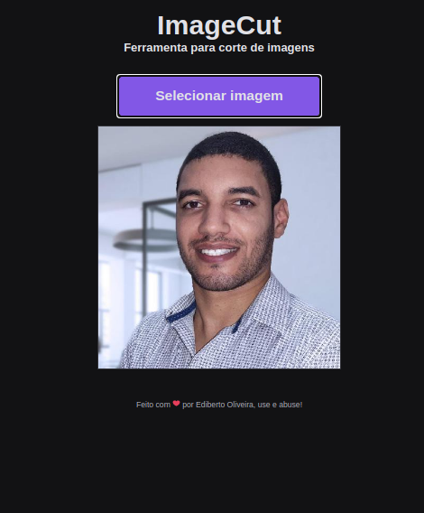
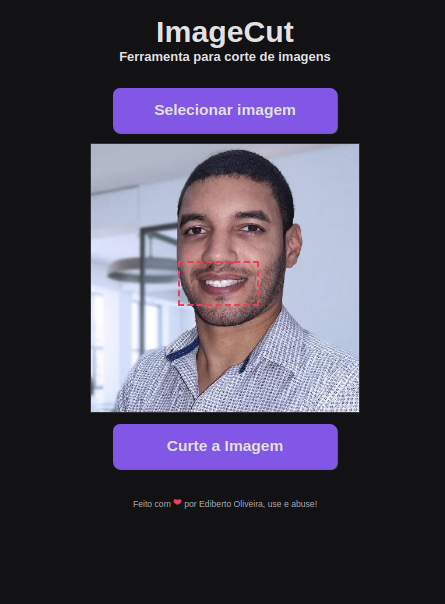
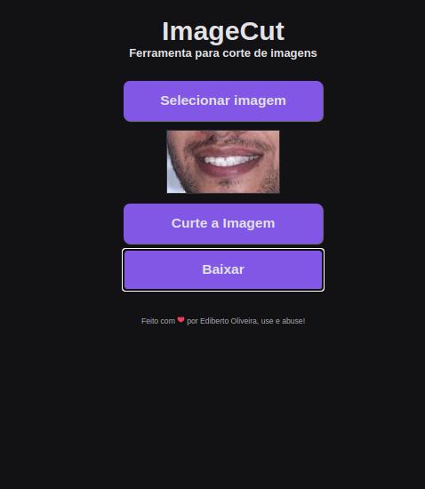

<p align="center">	
<a href="https://www.linkedin.com/in/ediberto-b-oliveira-872926178/">
  
  </a>
  

  <a aria-label="Completed" href="https://edibertooliveira.github.io/imageCut">
    </img>
  </a>
  <a href="https://github.com/edibertooliveira/imageCut/commits/master">
    
  </a> 

  <a href="https://github.com/edibertooliveira/imageCut/master/LICENSE">
    
  </a>
  
   <a href="https://github.com/edibertooliveira/imageCut/stargazers">
    
  </a>
</p>

# imageCut

### Web Screenshot

<div align="center" style="display: flex; flex-direction: 'row'; align-items: 'center';">
   
   
   
</div>

> :rocket: created for study using as basis the lessons of the <a href="https://github.com/maykbrito" target="_blink">Maik Brito</a> of <a href="https://github.com/Rocketseat" target="_blink">Rocketseat</a>. I made my modifications, because I use it constantly to cut images quickly.

### :pushpin: Table of Contents

* [Technologies](#computer-technologies)
* [Features](#rocket-features)
* [Interesting things covered in this project](#Covered-in-this-project)
* [How to Run](#construction_worker-how-to-run)
* [Found a bug? Missing a specific feature?](#bug-issues)
* [License](#closed_book-license)

### :computer: Technologies
This project was made using the follow technologies:
<ul>
  <li><a href="https://developer.mozilla.org/">HTML5</a></li>
  <li><a href="https://css-tricks.com/">CSS3</a></li>
  <li><a href="https://www.javascript.com/">Javascript</a></li>
</ul>

### :rocket: Features

* To speed up image editing without using more elaborate applications

### Covered in this project

<ul>
  <li>Create a new instance of HTMLImageElement Image().</li>
  <li>Working with objects in events.</li>
  <li>HTML Canvas API</li>
  <li>Cropping image in Canvas API.</li>
  <li>Handling multiple events in an element.</li>
  <li>Download image modification</li>
</ul>

> Status: Completo.

### :construction_worker: How to run
```bash
# Clone Repository
$ git clone https://github.com/edibertooliveira/imageCut.git

```

### :bug: Issues
Feel free to **file a new issue** with a respective title and description on the the [imageCut](https://github.com/edibertooliveira/imageCut/issues) repository. If you already found a solution to your problem, **i would love to review your pull request**!

### :closed_book: License
Released in 2020 :closed_book: License

Made with love by [Ediberto Oliveira](https://github.com/edibertooliveira/) 🚀.
This project is under the [MIT license](https://github.com/edibertooliveira/imageCut/master/LICENSE).

Give a ⭐️ if this project helped you!